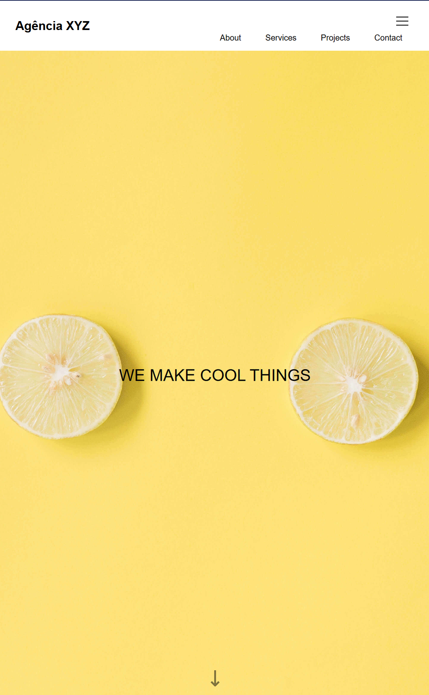
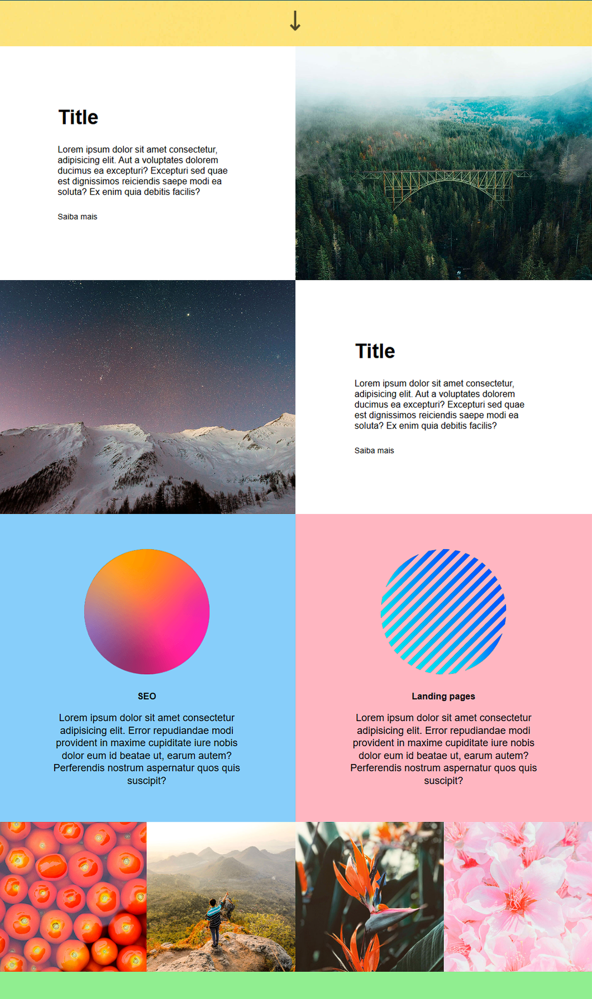

# Agência XYZ

Landing page de uma agência fictícia, em HTML e CSS, com seções de destaque, serviços e galeria.

Demo: https://theusan777.github.io/landing-page-2/

## Preview

<p align="center">
  
</p>

<p align="center">
  
</p>

## Sobre o projeto

Página de uma agência fictícia (Agência XYZ), com um hero de destaque, duas seções de conteúdo lado a lado com imagem, uma seção de serviços (SEO e Landing pages) com fundo colorido, e uma galeria de fotos em grid.

Os textos ainda estão com Lorem ipsum e os links "Saiba mais" e os ícones de redes sociais no rodapé não apontam pra lugar nenhum.

## Tecnologias

- HTML
- CSS

## Funcionalidades

- Navegação por âncora (About, Services, Projects, Contact)
- Seções de conteúdo alternando texto e imagem
- Seção de serviços com fundo colorido e ícones
- Galeria de imagens em grid

## Estrutura do projeto

```
index.html
src/
  images/
```

## Como executar

git clone https://github.com/theusan777/landing-page-2.git

Depois é só abrir o `index.html` no navegador.

## Deploy

[Acessar projeto](https://theusan777.github.io/landing-page-2/)

## Aprendizados

Projeto de prática de composição visual, alternando seções de texto e imagem lado a lado e blocos coloridos, em vez de um layout só de coluna única.

## Próximos passos

- Substituir os textos Lorem ipsum por conteúdo real
- Adicionar links reais nos botões "Saiba mais" e nos ícones do rodapé
